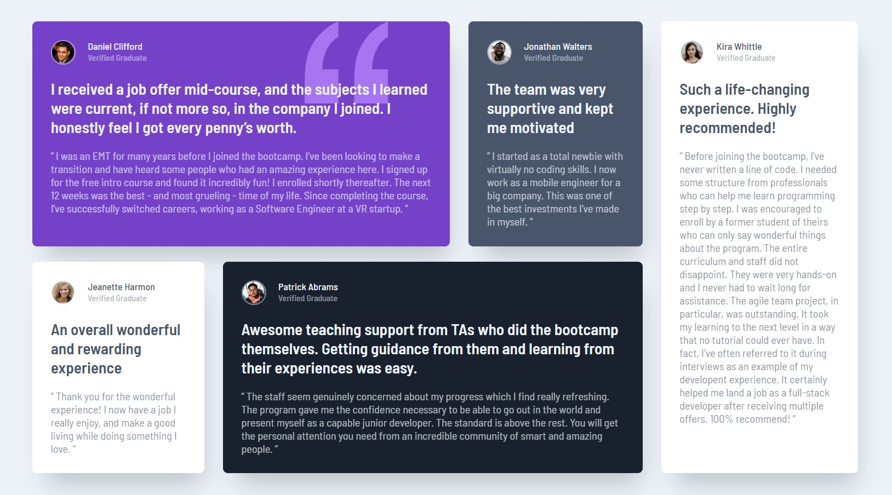

# _Frontend Mentor - Testimonials grid section_ 🙋‍

_This is a solution to the_ [_Testimonials grid section on Frontend Mentor_](https://www.frontendmentor.io/challenges/testimonials-grid-section-Nnw6J7Un7).

#### _Table of contents_

- [_Overview_](#overview)
  - [_The challenge_](#the-challenge)
  - [_Screenshot-Solution_](#screenshot-solution)
  - [_Links_](#links)
- [_My process_](#my-process)
  - [_Built with_](#built-with)
  - [_What I learned_](#what-i-learned)
  - [_Continued development_](#continued-development)
  - [_Useful resources_](#useful-resources)
- [_Author_](#author)

## _Overview_

### _The Challenge_

Your users should be able to:  
✔ View the optimal layout for the site depending on their device's screen size

- **_Desktop Design_**

<!--  -->

### *Screenshot-Solution*🙋‍♀️

- **_Desktop_**

<!--  -->

- **_Mobile_**

<!--  -->

### _Links_

📎[Link](https://sookm.github.io/frontendmentor-chanllenges/testimonials-grid-section-main/)

## _My process_ 🙋‍♀️

### _Built with_

- CSS
- Grid
- HTML5

### _What I learned_
- CSS Grid
  - Grid columns and rows 
  - How to order in Grid layout 

### _Useful resources_ 
- repository I referred to  
https://github.com/ishpaul777/Testimonial-grid/blob/main/index.html
- resources  
https://developer.mozilla.org/ko/docs/Web/CSS/CSS_Grid_Layout/Line-based_placement_with_CSS_grid  
https://www.youtube.com/watch?v=rg7Fvvl3taU

